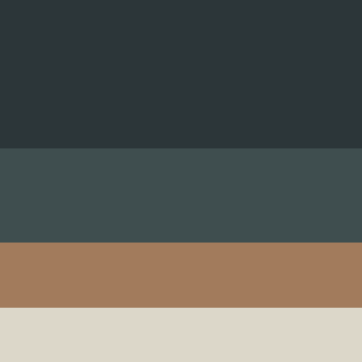

# Survey-Form
Just HTML-CSS

| Where I used    | Hex Codes |
| :---------------| :---------|
| Body Background | #2C3639   |
| Form Background | #3F4E4F   |
| Button Color    | #A27B5C   |
| Text Color      | #DCD7C9   |

